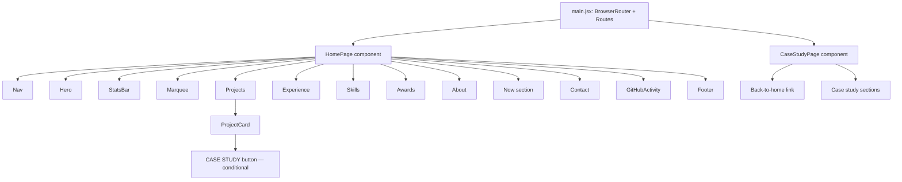

# Design Document — Portfolio Enhancements

## Overview

This design covers the architectural changes needed to extend the existing React + Vite single-page portfolio into a multi-page application with dedicated case-study routes, a live GitHub activity component, a "Now" section, and cleanup of unused dependencies and documentation.

The key additions are:

1. **Client-side routing** via `react-router-dom` to support `/case-study/:slug` pages while preserving the current home-page experience.
2. **CaseStudy page component** — a reusable page that renders per-project deep-dive content sourced from `data.js`.
3. **Data model extensions** in `src/data.js` for case-study content and a "now" blurb.
4. **ProjectCard modification** — conditional "CASE STUDY" button with router-based navigation.
5. **GitHubActivity component** — fetches, caches, and displays the user's latest public GitHub event.
6. **Now section component** — a simple data-driven section placed between About and Contact.
7. **Dependency cleanup** — remove `gsap` from package.json.
8. **README update** — accurate description of theme, stack, and data exports.

## Architecture

### Routing Strategy

```mermaid
graph TD
    A[main.jsx] --> B[BrowserRouter]
    B --> C{Route Matching}
    C -->|"/"| D[HomePage — current App layout]
    C -->|"/case-study/:slug"| E[CaseStudyPage]
    C -->|"*"| F[Navigate to "/"]
```

**Design decisions:**

- **BrowserRouter** is chosen over HashRouter for cleaner URLs. Vite's dev server already handles SPA fallback. For production, the existing Vercel hosting auto-handles this. A `vite.config.js` comment or `vercel.json` note will document the requirement for SPA fallback on other hosts.
- **Route structure:** The `BrowserRouter` wraps the entire app at `main.jsx`. The current `App` component becomes the home page route. A new `CaseStudyPage` component handles `/case-study/:slug`.
- **Lenis integration:** Lenis will remain on the home page. On the case-study page, the smooth scroll instance is reinitialised (or standard scroll is used) since Lenis scroll position won't carry across routes.
- **Navigation links:** The existing `Nav` uses anchor `href="#section"` links. On non-home pages, these need to navigate back to home first. The design uses `react-router-dom`'s `Link` only for the case-study button; the Nav will prepend `/` to anchor hrefs when on a case-study page (using `useLocation`).

### Component Hierarchy



## Components and Interfaces

### 1. Router Setup (`src/main.jsx`)

Wrap the app in `BrowserRouter`. Define routes:

```jsx
import { BrowserRouter, Routes, Route, Navigate } from 'react-router-dom'
import App from './App'
import CaseStudyPage from './pages/CaseStudyPage'

// Routes
<BrowserRouter>
  <Routes>
    <Route path="/" element={<App />} />
    <Route path="/case-study/:slug" element={<CaseStudyPage />} />
    <Route path="*" element={<Navigate to="/" replace />} />
  </Routes>
</BrowserRouter>
```

### 2. CaseStudyPage (`src/pages/CaseStudyPage.jsx`)

**Props:** None (reads `slug` from `useParams()`).

**Behaviour:**
- Looks up `caseStudies[slug]` from data.js.
- If slug not found, redirects to `/`.
- Renders sections: heading, problem statement, architecture/decisions, screenshots/diagrams, "What I'd Improve Next", and a back link.
- Scrolls to top on mount.

**Interface:**

```jsx
function CaseStudyPage() {
  const { slug } = useParams()
  const study = caseStudies[slug]
  if (!study) return <Navigate to="/" replace />
  // render sections...
}
```

### 3. ProjectCard Modification (`src/components/ProjectCard.jsx`)

**Changes:**
- Accept `project.caseStudyPath` (string | undefined).
- When present, render a `<Link>` styled as the "CASE STUDY" button between "Live Demo" and "View Code".
- Uses `react-router-dom`'s `<Link>` for client-side navigation (no page reload).

```jsx
import { Link } from 'react-router-dom'

// Inside project-actions div:
{project.caseStudyPath && (
  <Link className="project-link case-study-link" to={project.caseStudyPath}>
    <span>CASE STUDY</span>
  </Link>
)}
```

### 4. GitHubActivity (`src/components/GitHubActivity.jsx`)

**Behaviour:**
- On mount, checks `sessionStorage` for cached response (key: `gh_activity`).
- If cache is fresh (< 10 min), uses it. Otherwise fetches from `https://api.github.com/users/bhavishyeah/events/public` with a 5-second `AbortController` timeout.
- Filters for `PushEvent` or `CreateEvent`, takes first match.
- Displays: repo name, action label ("Pushed to" / "Created"), relative timestamp.
- On failure/timeout/empty: shows fallback link to GitHub profile.
- While loading: renders a subtle pulsing skeleton placeholder.

**Interface:**

```jsx
function GitHubActivity() {
  // Returns a <div className="gh-activity"> rendered above or inside Footer
}
```

**Caching strategy:** `sessionStorage` with a stored timestamp. On read, compare `Date.now() - storedTime`; if > 10 min (600000 ms), refetch. This gives 5–15 min effective caching depending on session lifecycle.

**Relative time formatting:** A small `formatRelativeTime(dateString)` utility:
- < 60s → "Xs ago"
- < 60min → "Xm ago"
- < 24h → "Xh ago"
- else → "Xd ago"

### 5. Now Section (`src/components/Now.jsx`)

**Behaviour:**
- Reads `nowContent` from `data.js`.
- Renders inside a `<section id="now">` with the same styling pattern (section-label, section-title, body text).
- Placed between About and Contact in `App.jsx`.

**Interface:**

```jsx
import { nowContent } from '../data'

function Now() {
  return (
    <section id="now">
      <div className="container">
        <Reveal as="div" className="section-head">
          <span className="section-label">Now <span className="idx">/ 06</span></span>
          <h2 className="section-title">What I'm <span className="accent">building now.</span></h2>
        </Reveal>
        <Reveal as="p" className="now-text">{nowContent}</Reveal>
      </div>
    </section>
  )
}
```

### 6. Nav Update for Multi-Page Support

When on a case-study page, anchor links like `#projects` should navigate to `/#projects`. The Nav component will use `useLocation()` to detect the current path. If not on `/`, it will prefix anchor hrefs with `/`.

```jsx
const { pathname } = useLocation()
const prefix = pathname === '/' ? '' : '/'
// href={`${prefix}${item.href}`}
```

## Data Models

### Case Study Data Structure (added to `src/data.js`)

```javascript
export const caseStudies = {
  selfwinner: {
    slug: 'selfwinner',
    name: 'SelfWinner',
    problem: 'Placeholder: Students struggle to find reliable, affordable study materials...',
    decisions: [
      {
        title: 'Razorpay Payment Integration',
        description: 'Placeholder: Chose Razorpay for seamless UPI + card payments...',
      },
      {
        title: 'JWT + Google OAuth Authentication',
        description: 'Placeholder: Dual auth strategy for flexibility and security...',
      },
    ],
    media: [
      {
        src: '/images/selfwinner-payment-flow.png',
        alt: 'Placeholder: SelfWinner payment flow diagram showing user checkout to Razorpay callback',
      },
    ],
    improvements: [
      'Placeholder: Add subscription-based access tier for recurring revenue.',
      'Placeholder: Implement full-text search across notes with Elasticsearch.',
    ],
  },
  'robot-voting-arena': {
    slug: 'robot-voting-arena',
    name: 'Robot Voting Arena',
    problem: 'Placeholder: Live events need real-time audience participation...',
    decisions: [
      {
        title: 'WebSocket Strategy',
        description: 'Placeholder: Used WebSockets for sub-second vote propagation...',
      },
      {
        title: 'Leaderboard Ranking Logic',
        description: 'Placeholder: Server-side sorted set ensures consistent ordering...',
      },
    ],
    media: [
      {
        src: '/images/robot-voting-leaderboard.png',
        alt: 'Placeholder: Robot Voting Arena leaderboard update flow showing WebSocket broadcast',
      },
    ],
    improvements: [
      'Placeholder: Add historical round replay with animated score timelines.',
      'Placeholder: Implement rate limiting per user to prevent vote spamming.',
    ],
  },
}
```

### Project Data Addition (modify existing `projects` array entries)

```javascript
// Add to SelfWinner project object:
caseStudyPath: '/case-study/selfwinner',

// Add to Robot Voting Arena project object:
caseStudyPath: '/case-study/robot-voting-arena',

// All other projects: no caseStudyPath field (or omit entirely)
```

### Now Content (added to `src/data.js`)

```javascript
export const nowContent = 'Currently scaling and upgrading the SelfWinner platform.'
```

### GitHub Activity Cache Schema (sessionStorage)

```javascript
// Key: 'gh_activity'
// Value: JSON.stringify({ data: EventObject, timestamp: number })
```


## Correctness Properties

*A property is a characteristic or behavior that should hold true across all valid executions of a system — essentially, a formal statement about what the system should do. Properties serve as the bridge between human-readable specifications and machine-verifiable correctness guarantees.*

### Property 1: Case study button conditional rendering

*For any* project data object, the ProjectCard component SHALL render a "CASE STUDY" button if and only if the project's `caseStudyPath` property is a non-empty string, and when rendered, the button's navigation target SHALL equal the `caseStudyPath` value exactly.

**Validates: Requirements 4.1, 4.3**

### Property 2: GitHub event type filtering

*For any* array of GitHub event objects (with varying `type` fields such as "PushEvent", "CreateEvent", "WatchEvent", "ForkEvent", etc.), the event filter function SHALL return the first event whose type is either "PushEvent" or "CreateEvent", or `null` if no such event exists in the array.

**Validates: Requirements 5.1**

### Property 3: Relative time formatting

*For any* timestamp in the past, the `formatRelativeTime` function SHALL produce a string ending with "ago" where the unit is: "s" when the delta is less than 60 seconds, "m" when less than 60 minutes, "h" when less than 24 hours, and "d" otherwise — and the numeric value SHALL equal the floor of the delta divided by the unit's duration.

**Validates: Requirements 5.2**

### Property 4: Cache freshness determination

*For any* stored timestamp and current time, the cache freshness check SHALL return `true` (fresh/use cache) when the elapsed time is less than 10 minutes (600,000 ms), and `false` (stale/refetch) when the elapsed time is greater than or equal to 10 minutes.

**Validates: Requirements 5.5**

## Error Handling

### GitHub Activity Strip Errors

| Failure Mode | Handling |
|---|---|
| Network error (fetch rejects) | Catch error, render fallback link to GitHub profile |
| Timeout (> 5s) | AbortController aborts request, catch AbortError, render fallback |
| Empty response / no matching events | Filter returns null, render fallback link |
| Malformed JSON | Catch parse error, render fallback |
| Rate-limited (403) | Treat as fetch failure, render fallback |

The fallback in all cases is a styled link: "See my latest work on GitHub →" pointing to `https://github.com/bhavishyeah`.

### Case Study Page — Invalid Slug

If a user navigates to `/case-study/nonexistent`, the component checks `caseStudies[slug]`. If undefined, it renders `<Navigate to="/" replace />` immediately, sending the visitor back to the home page.

### Data Integrity

All case-study content uses placeholder text prefixed with "Placeholder:" so broken images or missing content are clearly visible during development. Images use descriptive alt text even for placeholders.

## Testing Strategy

### Test Framework Setup

Since no test framework currently exists, the project will add:
- **Vitest** as the test runner (native Vite integration, fast, compatible with the existing tool chain)
- **@testing-library/react** for component rendering tests
- **fast-check** for property-based tests

### Unit Tests (Example-Based)

| Area | Tests |
|---|---|
| CaseStudyPage rendering | Verify section order, content from data, back link, heading, media alt text |
| ProjectCard CASE STUDY button order | Verify DOM order: Live Demo → CASE STUDY → View Code |
| GitHubActivity loading state | Mock pending fetch, verify skeleton renders |
| GitHubActivity fallback states | Mock rejection / timeout / empty, verify fallback link |
| Now section content | Verify renders `nowContent` from data |
| Data validation | Verify only SelfWinner and Robot Voting Arena have `caseStudyPath` |
| Route catch-all | Navigate to invalid path, verify redirect to `/` |

### Property-Based Tests (fast-check)

Each property test runs a minimum of **100 iterations**.

| Property | Tag | Description |
|---|---|---|
| Property 1 | Feature: portfolio-enhancements, Property 1: Case study button conditional rendering | Generate random project objects with/without `caseStudyPath`, verify button presence matches field presence and link matches value |
| Property 2 | Feature: portfolio-enhancements, Property 2: GitHub event type filtering | Generate random arrays of event objects with various `type` values, verify filter returns first PushEvent/CreateEvent or null |
| Property 3 | Feature: portfolio-enhancements, Property 3: Relative time formatting | Generate random past timestamps, verify unit selection and numeric value match the delta |
| Property 4 | Feature: portfolio-enhancements, Property 4: Cache freshness determination | Generate random elapsed-time values (0 to 30 min), verify boolean result matches threshold comparison |

### Integration Tests

| Area | Tests |
|---|---|
| Routing | Navigate between home and case-study pages, verify no full reload |
| SPA fallback | Directly access `/case-study/selfwinner` in test browser, verify renders |
| Build verification | `npm run build` exits with code 0 after gsap removal |

### Smoke Tests

| Area | Tests |
|---|---|
| gsap removal | Verify package.json has no gsap entry |
| gsap imports | Grep src/ for gsap imports |
| README accuracy | Verify theme description and export list match actual project |
